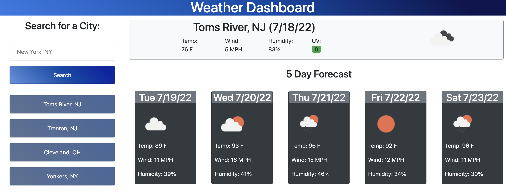

# weather-dashboard

## Purpose
A weather app to find out the forecast for a given location

## Built With
* HTML
* CSS
* Bootstrap
* Javascript
* MomentJS
* Open Weather API

## Website
[https://mnwana.github.io/weather-dashboard/](https://mnwana.github.io/weather-dashboard/)

## Screenshot

## Contribution
Made with ❤️ by Marielle Nwana
